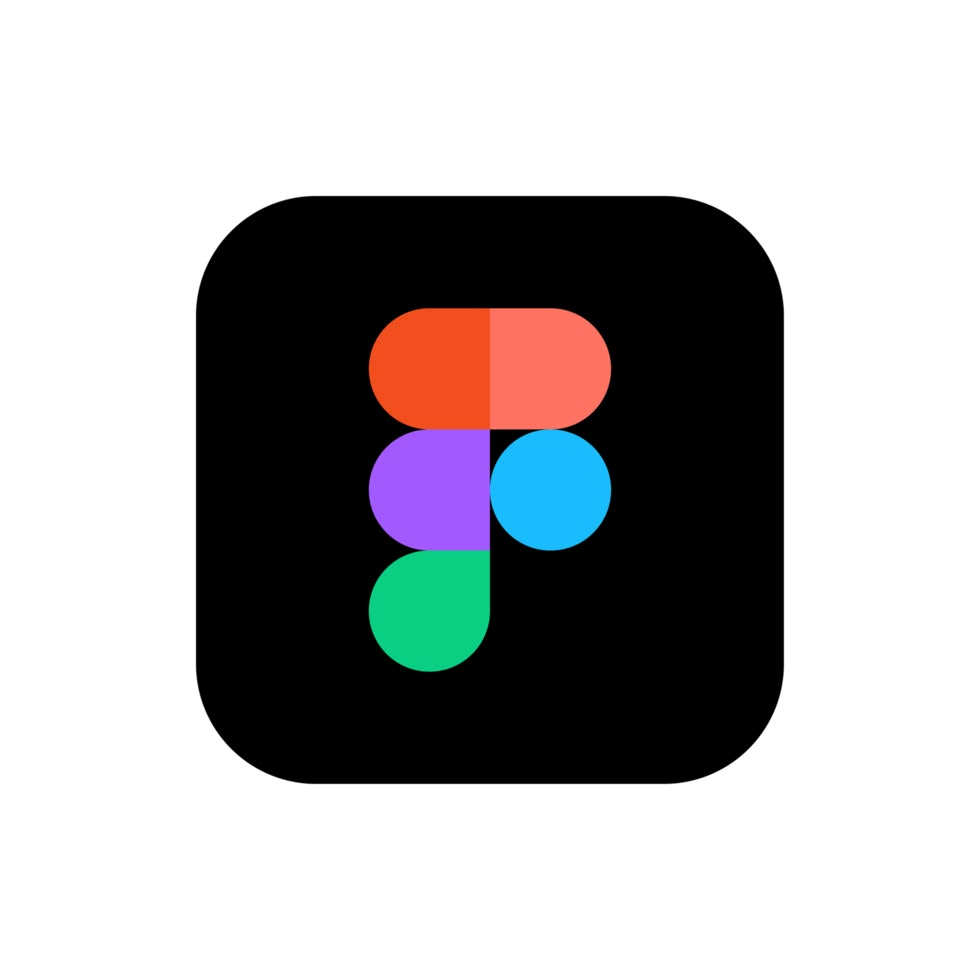
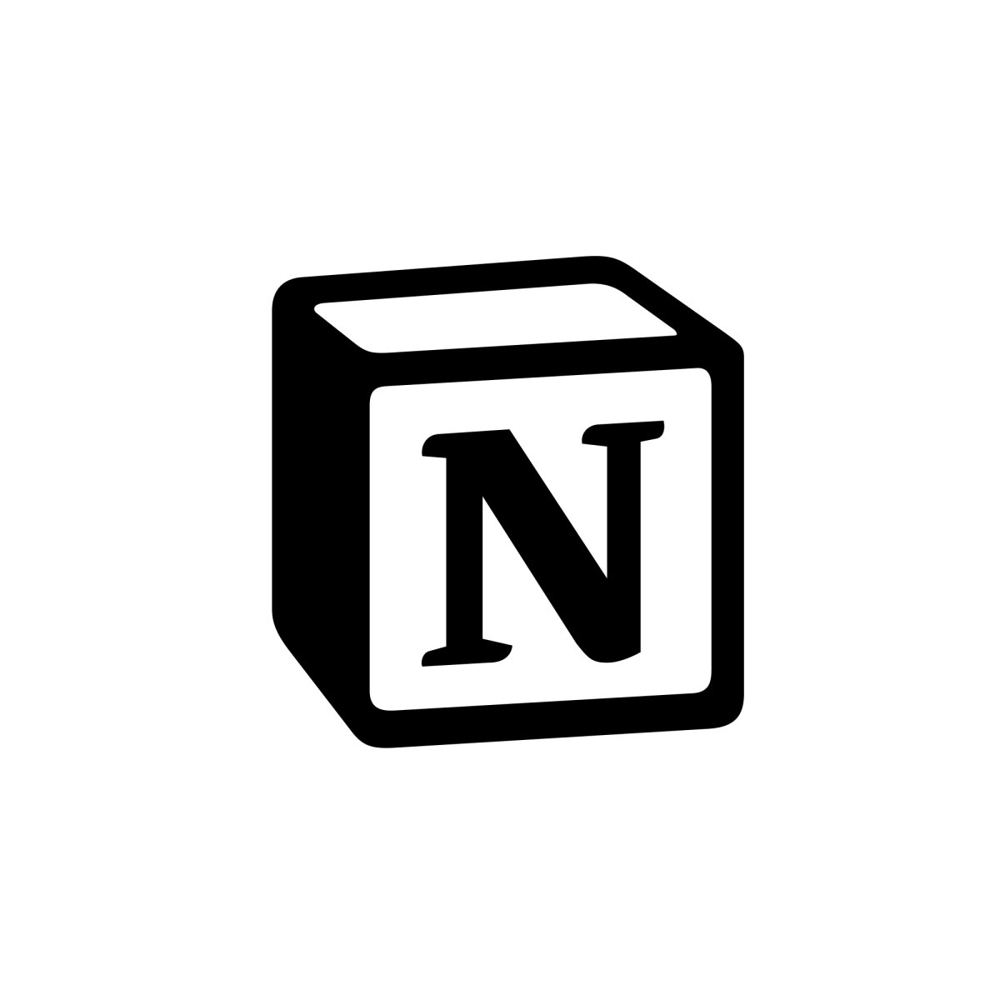

## Hi 👋, I'm Megha Salunke

### 🚀 Currently Working On  

🎨 Designing real-world UI/UX case studies  

💻 Learning JavaScript & Frontend Development  

🤖 Exploring AI for Design & Productivity  

 ---
### About Me 
I finished my bachelor's of Engineering degree in Data Information Technology from Bharati Vidyapeeth's College of Engineering for Women Pune,Maharashtra in June 2025. I'm eager to apply my analytical skills to real-world challenges.🎯

---
### 🔧 Technical Stack & tools I worked with  
#### 🎨 Design Tools

  
  
  

#### 🧩 UI/UX Skills

#### 💻 Tech  

<!--

-->

<!--#### 🤖 AI & Analytics  

 -->

#### 🧰 Tools & Platforms  

<!-- -->

---
### 📊 GitHub Status

  

  

---
### 📫 Connect with me  

